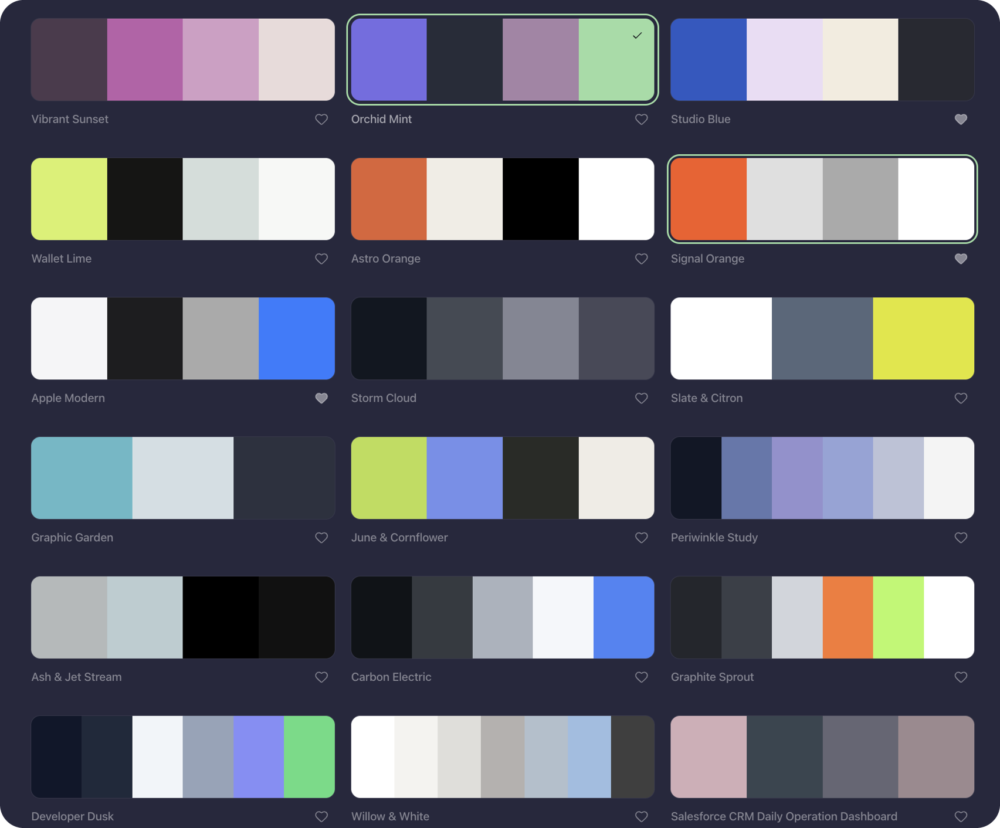

<p align="center">
  
</p>

# Pallet

[](https://github.com/aka-kika/pallet)
[](https://www.typescriptlang.org/)
[](https://www.electronjs.org/)
[](docs/mac.md)
[](docs/mac.md)
[](https://github.com/aka-kika/pallet/releases/latest)
[](LICENSE)

Pallet is a Mac menu-bar app for collecting color palettes from images. Drop a picture, extract colors on this device, and copy light and soft-dark CSS. Nothing is uploaded.

<p align="center">
  
</p>

## Features

- Local color extraction. Pixels stay on this Mac.
- A drop zone in the menu bar, with Mini, Miny, and Mo sizes.
- A collection that restyles the whole window from the selected palette.
- Copy one hex, or copy light and dark CSS.
- Lock the background while you shuffle palettes.
- Favorites, delete with confirm, and a global shortcut you can record.
- Readable text on every palette, checked by `scripts/contrast-check.mjs`.
- Show Pallet in the Dock and menu bar, the Dock only, or the menu bar only.

## Collection

The main window is the selected palette on top and your cards below. Click a hex chip to copy it. Space shuffles. L locks the current background.



## Add an image

Drop, paste, or choose a file. Pallet samples visible pixels. No image leaves this device.


## Edit before saving

Name the palette, set the main color, remove extras with the corner X, then add it to the collection.


## Install

Latest release: **[1.1.1](https://github.com/aka-kika/pallet/releases/latest)**. What changed: [CHANGELOG.md](CHANGELOG.md).

Build it yourself with Node.js 24. See **[docs/mac.md](docs/mac.md)**, or double-click **Setup Mac.command**. After that, Pallet.app runs without Node.

```sh
npx --yes pnpm@11.25.0 install --frozen-lockfile
node desktop/build.mjs
npm ci --prefix desktop/runtime
node desktop/package.mjs
```

Browser preview while developing (palettes saved there last until the server restarts):

```sh
pnpm run dev
```

## Docs

- [Mac build, capture, and settings](docs/mac.md)
- [Desktop implementation](desktop/README.md)
- [Changelog](CHANGELOG.md)

## Release

Releases are tagged on GitHub (`v1.1.1` is the latest). Builds are unsigned and not notarized: Control-click Pallet.app, then Open, the first time. Data lives in `~/Library/Application Support/Palette/`.

## Contributing

See [CONTRIBUTING.md](CONTRIBUTING.md).

## License

MIT. See [LICENSE](LICENSE).
