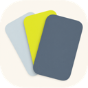
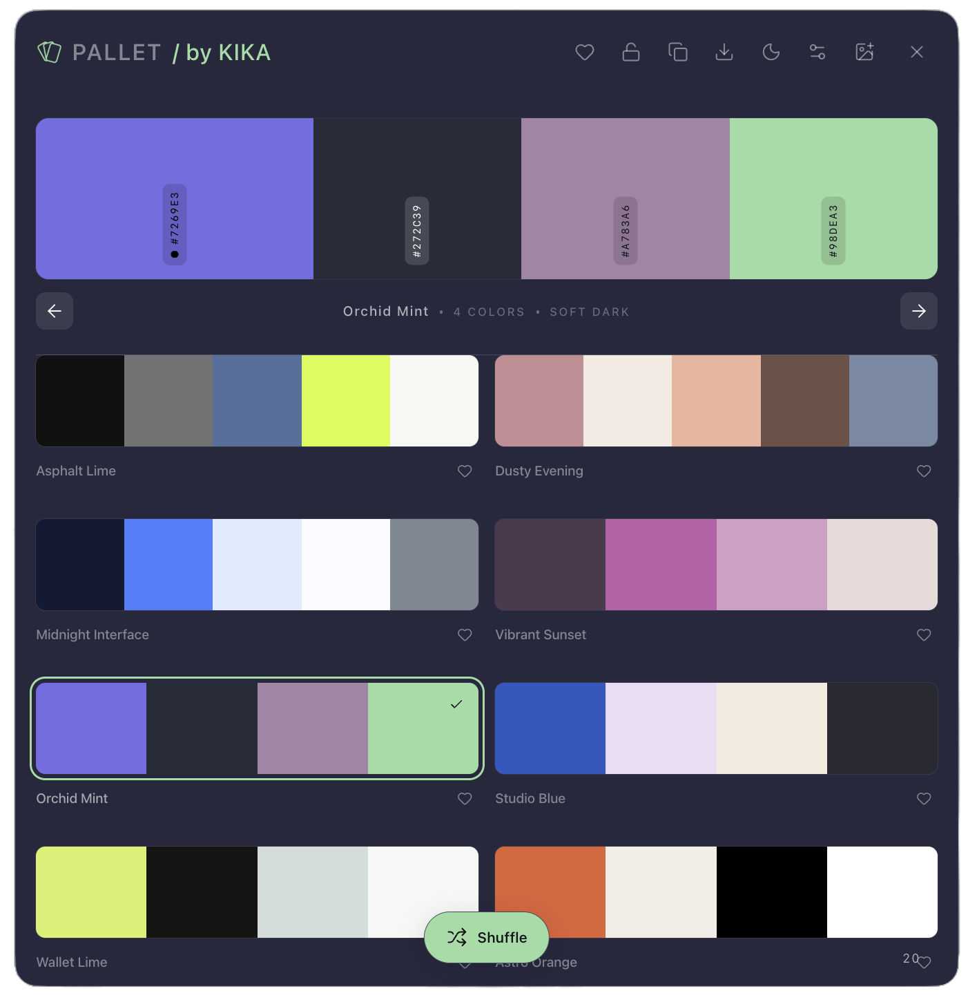
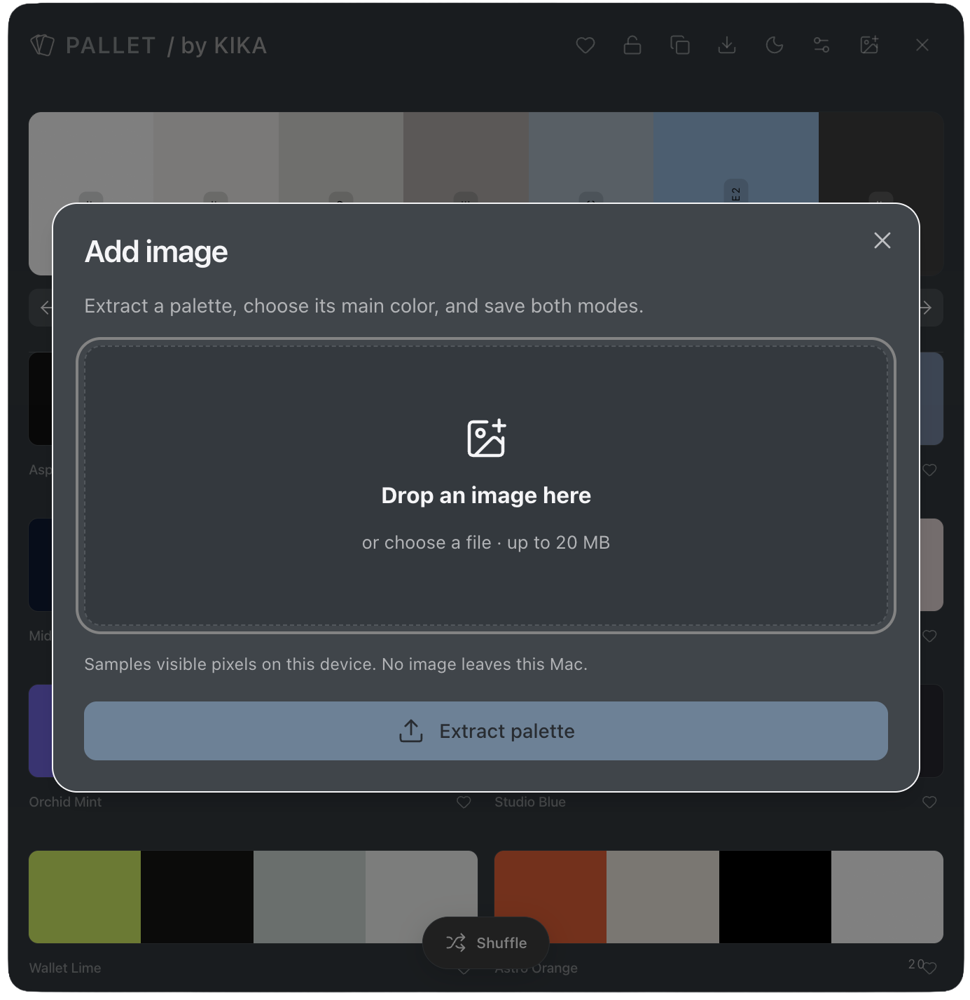
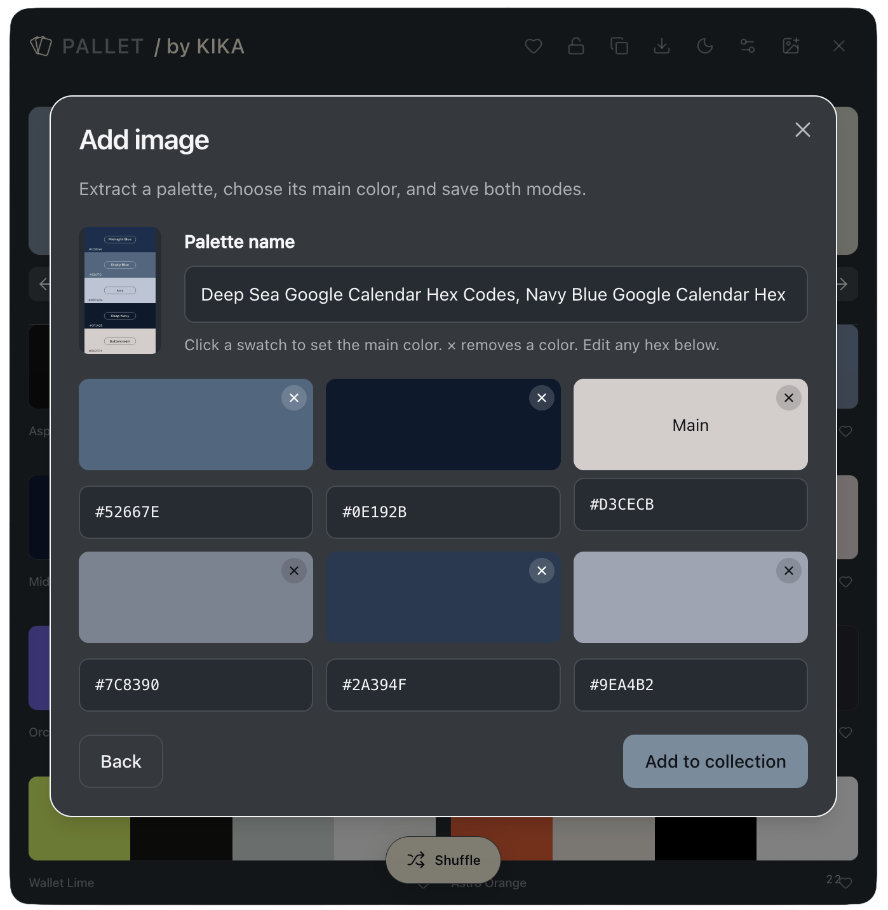

<p align="center">
  
</p>

# Pallet

[](https://github.com/aka-kika/pallet)
[](https://www.typescriptlang.org/)
[](https://www.electronjs.org/)
[](docs/mac.md)
[](docs/mac.md)
[](https://github.com/aka-kika/pallet)
[](LICENSE)

Pallet is a Mac menu-bar app for collecting color palettes from images. Drop a picture, extract colors on this device, and copy light and soft-dark CSS. Nothing is uploaded.

<p align="center">
  
</p>

## Features

- Local color extraction. Pixels stay on this Mac.
- A drop zone in the menu bar, with Mini, Miny, and Mo sizes.
- A collection that restyles the whole window from the selected palette.
- Copy one hex, or copy light and dark CSS.
- Lock the background while you shuffle palettes.
- Favorites, delete with confirm, and a global shortcut you can record.

## Collection

The main window is the selected palette on top and your cards below. Click a hex chip to copy it. Space shuffles. L locks the current background.


## Add an image

Drop, paste, or choose a file. Pallet samples visible pixels. No image leaves this device.



## Edit before saving

Name the palette, set the main color, remove extras with the corner X, then add it to the collection.



## Install

See **[docs/mac.md](docs/mac.md)**. You need Node.js 24 to build the unsigned app once. After that, Pallet.app runs without Node.

```sh
npm ci --prefix desktop/runtime
node desktop/build.mjs
node desktop/package.mjs
```

Web preview while developing:

```sh
pnpm install --frozen-lockfile
pnpm run dev
```

## Docs

- [Mac build and capture](docs/mac.md)
- [Desktop implementation](desktop/README.md)

## Release

Unsigned local builds only. Not notarized. Data is `~/Library/Application Support/Palette/`.

## Contributing

See [CONTRIBUTING.md](CONTRIBUTING.md).

## License

MIT. See [LICENSE](LICENSE).
