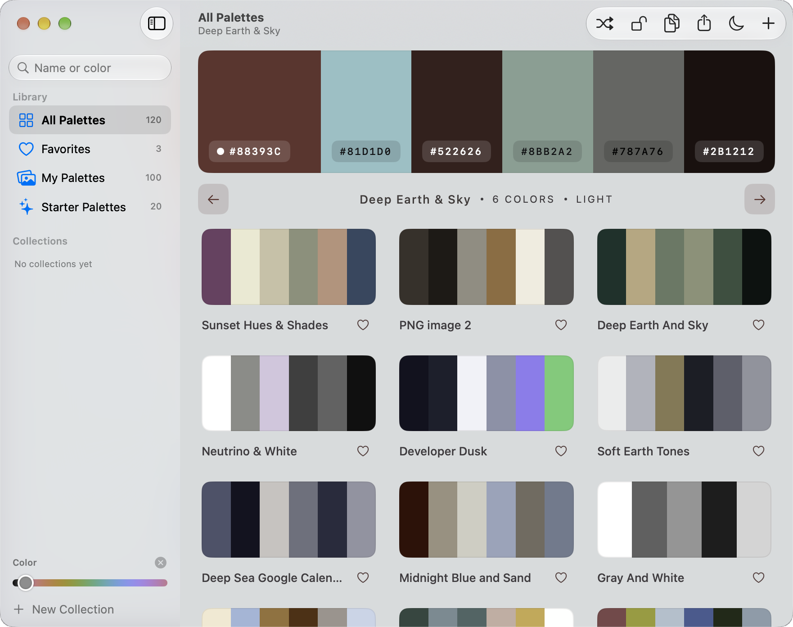
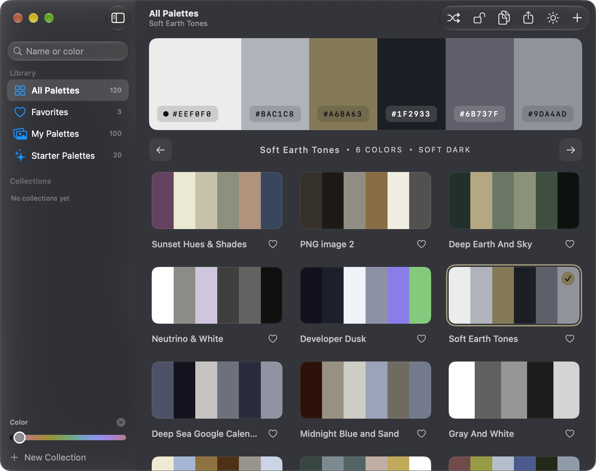
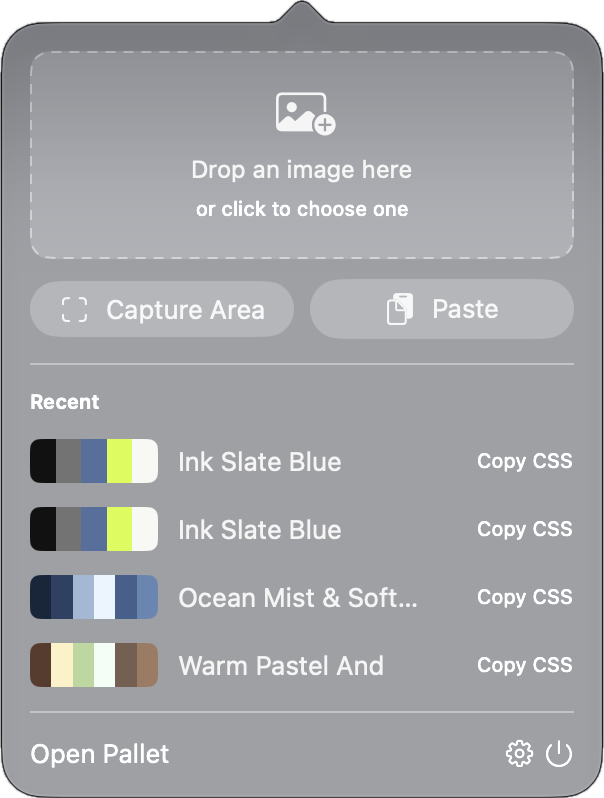
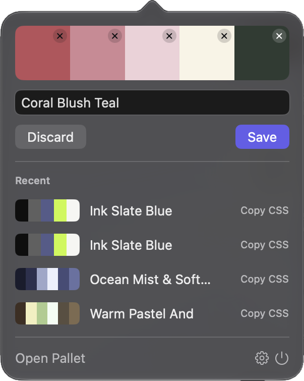
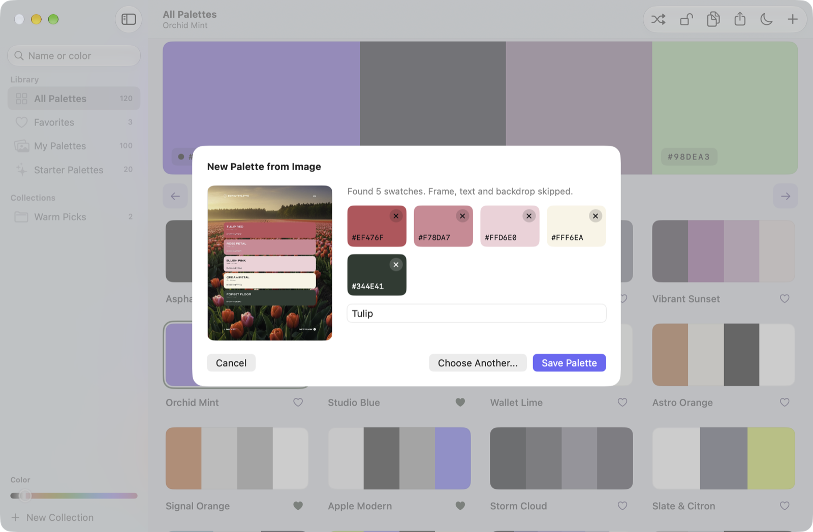
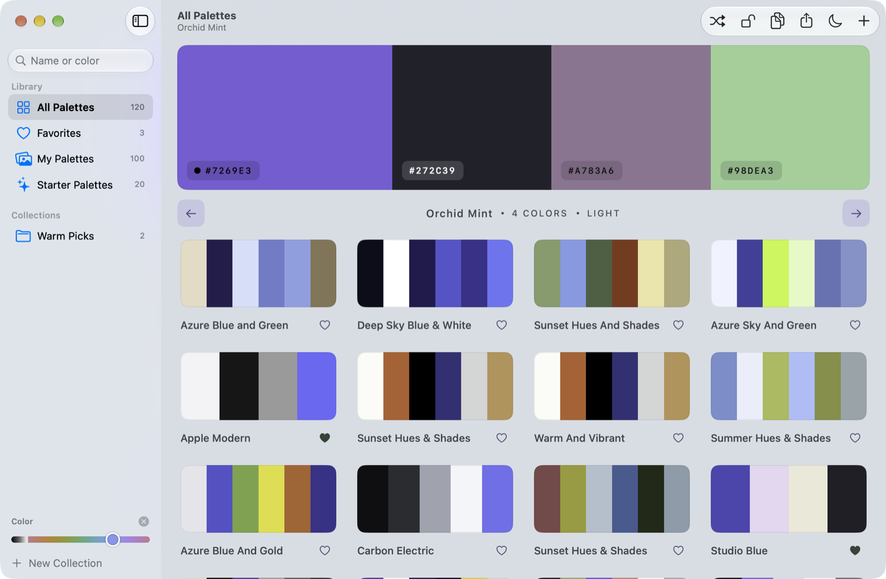

<p align="center">
  
</p>

# Pallet

[](https://github.com/aka-kika/pallet)
[](swiftui/README.md)
[](docs/mac.md)
[](https://github.com/aka-kika/pallet/releases/latest)
[](docs/mac.md)
[](LICENSE)

Pallet is a Mac app for collecting color palettes from images and the screen. Drop a picture, paste one, or capture any area of the screen: Pallet reads the real palette on this device and gives you light and soft-dark CSS. Nothing is uploaded.

<p align="center">
  
  
</p>

## Features

- **Smart extraction.** Palette graphics give only their swatches: no page frame, no text color, no photo behind the cards. Printed hex codes are read exactly, and a title becomes the name. Website screenshots give the site's background, surface, text and accent colors. Photos give their main colors.
- **Menu bar capture.** Pick any area of the screen from any app (Shift-Command-P), or open the menu bar panel (Option-Shift-Command-P) to drop or paste an image.
- **Theme that follows the palette.** The whole canvas recolors from the selected palette; left and right arrows change its main color. Every text color stays readable ([theme rules](docs/THEME-RULES.md)).
- **Library and collections.** All, Favorites, My Palettes, Starter Palettes, your own collections, search by name or color, and a color slider that keeps palettes with a chosen color.
- **Copy and export.** Copy one hex or the light and dark CSS, export CSS, Markdown or JSON, share or drag a palette out as a .css file.
- **A real Mac app.** Sidebar, customizable toolbar, undo for every change, recordable shortcuts, Dock and menu bar options.

## Menu bar capture

<p>
  
  
</p>

## New palette from an image

The colors come straight from the swatches; the tulip photo behind the cards is skipped.



## Color slider



## Install

Download **[Pallet 2.0](https://github.com/aka-kika/pallet/releases/latest)** (macOS 26 or newer), unzip, and move Pallet.app to Applications. It is signed with Developer ID and notarized by Apple. What changed: [CHANGELOG.md](CHANGELOG.md).

## Build

Build with Xcode 27.2 or newer on macOS 26 or newer. See **[docs/mac.md](docs/mac.md)**.

```sh
xcodebuild -project swiftui/Pallet.xcodeproj -scheme Pallet -configuration Release build
```

Your palettes live in `~/Library/Application Support/Palette/`.

## Web version

The same app runs as a web page at **[akakika.com/pallet](https://akakika.com/pallet/)**, with Kika's collection and a download button. Visitors' own palettes stay in their browser.

```sh
pnpm install --frozen-lockfile
pnpm run dev            # local preview (Next.js)
pnpm site:build         # static build into the akakika.com repo (public/pallet/)
pnpm site:publish       # copy the Mac collection (names and colors) to the site, commit, push
```

Built-in palettes are shared in `shared/builtin-palettes.json`; `lib/palettes.ts` and `swiftui/Pallet/Model/Theme.swift` compute the same theme.

## Docs

- [Mac app: build, capture, settings](docs/mac.md)
- [SwiftUI code map](swiftui/README.md)
- [Theme rules](docs/THEME-RULES.md)
- [Changelog](CHANGELOG.md)

## Contributing

See [CONTRIBUTING.md](CONTRIBUTING.md).

## License

MIT. See [LICENSE](LICENSE).
